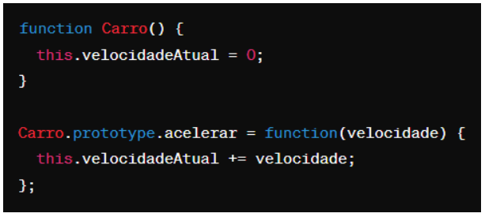

# Questões objetivas

**1)** O que o código a seguir faz?


Escolha a opção que responde corretamente:

**a) Imprime os números pares de 1 a 10.** (opção correta)

b) Imprime os números ímpares de 1 a 10.

c) Imprime os números pares de 2 a 10.

d) Imprime os números ímpares de 2 a 10.

______

**2)** Identificar a linha que falta no código para criar uma classe Veiculo com atributo marca, e uma classe Carro que herda de Veiculo com um método ligar(). 


No lugar onde está escrito “// linha” qual das opções abaixo deve estar para funcionar corretamente o código?

**A) let carro = new Carro("Toyota");** (opção correta)

B) let ligar = new ligar("Toyota");

C) class Moto extends Veiculo {};

D) carro1.ligar();

______

**3)** Qual é o valor de resultado após a execução deste código?


Escolha a opção que responde corretamente:

**A) 18** (opção correta)

B) 16

C) 14

D) 12

______

**4)** Como você criaria um método `acelerar()` em uma classe `Carro`, que recebe um parâmetro `velocidade` e o adiciona a um atributo `velocidadeAtual`?

**A) ** (opção correta)

B) 

C) 

D) 

______

**5)** Qual a forma correta de definir uma classe Carro em JavaScript, com um método ligar() e um atributo marca?

**A) ** (opção correta)

B) 

C) 

D) 

______

**6)** Observe o código abaixo:


Qual será a saída do código acima?

**A) "Olá, meu nome é João. Olá, meu nome é Maria."** (opção correta)

B) "Olá, meu nome é ."

C) "João Maria"

D) "undefined undefined"

______

# Questões dissertativas

**7)** Criação de um programa em JavaScript que simula a descrição de animais por meio de uma classe chamada Animal. Essa classe possui dois atributos, nome e idade, e um método chamado descrever() que exibe informações no console. No programa, foram criados dois objetos distintos, representando um cachorro e um gato. Cada um desses animais possui uma idade diferente. Utilização do método descrever() para imprimir detalhes específicos de cada animal no console.
```
// definição da classe Animal
class Animal {
    // construtor da classe com parâmetros nome e idade
    constructor(nome, idade) {
        // atribuição dos valores dos parâmetros aos atributos da classe
        this.nome = nome;
        this.idade = idade;
    }

    // método descrever() que imprime informações sobre o animal no console
    descrever() {
        console.log(`Olá, eu sou o ${this.nome} e tenho ${this.idade} anos.`);
    }
}

// criação de dois objetos da classe Animal - cachorro e gato - com valores específicos
var cachorro = new Animal("cachorro", 7);
var gato = new Animal("gato", 5);

// chamada do método descrever() para imprimir informações sobre o cachorro e o gato
cachorro.descrever();
gato.descrever();

```

______

**8)** Implementação da incorporação de uma classe chamada Gato, que herda os atributos e comportamentos da classe Animal. Adicionalmente, introduzação do atributo "cor", exclusivo para gatos, permitindo a especificação da coloração de cada indivíduo. Para aprimorar a singularidade da classe Gato, inclusão do método miar(), que exibe o característico som emitido por esses felinos.
```
// definição da classe Animal
class Animal {
    // construtor da classe com parâmetros nome e idade
    constructor(nome, idade) {
        // atribuição dos valores dos parâmetros aos atributos da classe
        this.nome = nome;
        this.idade = idade;
    }

    // método descrever() que imprime informações básicas sobre o animal no console
    descrever() {
        console.log(`Olá, eu sou o ${this.nome} e tenho ${this.idade} anos.`);
    }
}

// definição da classe Gato que herda da classe Animal
class Gato extends Animal {
    // construtor da classe Gato com parâmetros adicionais (cor)
    constructor(nome, idade, cor) {
        // chamada ao construtor da classe pai (Animal) usando super()
        super(nome, idade);
        // atribuição do valor do parâmetro cor ao atributo específico da classe Gato
        this.cor = cor;
    }

    // método descrever() sobrescrito que imprime informações específicas sobre o gato no console
    descrever() {
        console.log(`Olá, eu sou o ${this.nome}, tenho ${this.idade} anos, tenho pelagem ${this.cor}`);
    }

    // método miar() específico da classe Gato que imprime um som característico no console
    miar() {
        console.log("E faço esse som 'miau!'");
    }
}

// criação de um objeto da classe Animal (cachorro) com valores específicos
var cachorro = new Animal("cachorro", 7);

// criação de um objeto da classe Gato com valores específicos, incluindo a cor da pelagem
var gato = new Gato("gato", 5, "marrom");

// chamada do método descrever() para imprimir informações sobre o cachorro e o gato
cachorro.descrever();
gato.descrever();

// chamada do método miar() específico da classe Gato para imprimir um som característico
gato.miar();

```

______

**9)** Desenvolvimento de um programa em JavaScript voltado para a soma de notas, utilizando uma classe denominada SomadorDeNotas. Esta classe possui um atributo "total", inicializado em 0, responsável por armazenar a soma das notas. Adicionalmente, integração do método adicionarNota(nota), que permite adicionar uma nota específica ao valor total. Em seguida, criação de um objeto chamado "somador", instanciando a classe SomadorDeNotas e utilizando seu método adicionarNota(nota) para incluir diversas notas. Por fim, implementação do método verTotal() para exibir o resultado no console. 
```
// definição da classe SomadorDeNotas
class SomadorDeNotas {
    // construtor que inicializa o atributo total com zero
    constructor() {
        this.total = 0;
    }

    // método para adicionar uma nota ao total
    adicionarNota(nota) {
        this.total += nota;
    }

    // método para exibir o total das notas no console
    verTotal() {
        console.log(`O total é: ${this.total}`);
    }
}

// criação de uma instância da classe SomadorDeNotas
var somador = new SomadorDeNotas();

// adição de várias notas utilizando o método adicionarNota
somador.adicionarNota(10);
somador.adicionarNota(9);
somador.adicionarNota(8);
somador.adicionarNota(7);
somador.adicionarNota(6);

// exibição do total das notas utilizando o método verTotal
somador.verTotal();

```

______

**10)** Este código em JavaScript define duas classes: Funcionario e Professor. A classe Funcionario tem atributos para nome, idade e salário base, com um método calcularSalario() a ser implementado posteriormente. A classe Professor herda de Funcionario, adicionando atributos específicos (disciplina e horas) e implementando um método calcularSalario() que calcula o salário multiplicando as horas trabalhadas por 50 (valor fictício da hora/aula). Dois objetos do tipo Professor são criados, cada um representando um professor com informações específicas, e o método calcularSalario() é chamado para exibir os salários calculados no console.
```
// definição da classe Funcionario
class Funcionario {
    // construtor da classe com atributos nome, idade e salárioBase
    constructor(nome, idade, salarioBase) {
        this.nome = nome;
        this.idade = idade;
        this.salarioBase = salarioBase;
    }

    // método calcularSalario() a ser implementado posteriormente
    calcularSalario() {
        // a implementação do cálculo do salário para Funcionario será definida posteriormente
    }
}

// definição da classe Professor, que herda de Funcionario
class Professor extends Funcionario {
    // construtor da classe Professor com atributos adicionais: disciplina e horas
    constructor(nome, idade, salarioBase, disciplina, horas) {
        // chamada ao construtor da classe pai usando super
        super(nome, idade, salarioBase);
        this.disciplina = disciplina;
        this.horas = horas;
    }

    // implementação do método calcularSalario específico para Professor
    calcularSalario() {
        this.salario = this.horas * 50; // cálculo do salário do professor com valor fictício da hora/aula
        console.log(`O salário de ${this.nome} é R$ ${this.salario}.`);
    }
}

// criação de dois objetos do tipo Professor com informações específicas
var professor1 = new Professor("Carlos", 30, 1500, "Português", 30);
var professor2 = new Professor("Jéssica", 40, 1500, "Física", 20);

// chamada do método calcularSalario() para cada objeto e exibição do salário no console
professor1.calcularSalario();
professor2.calcularSalario();


```
